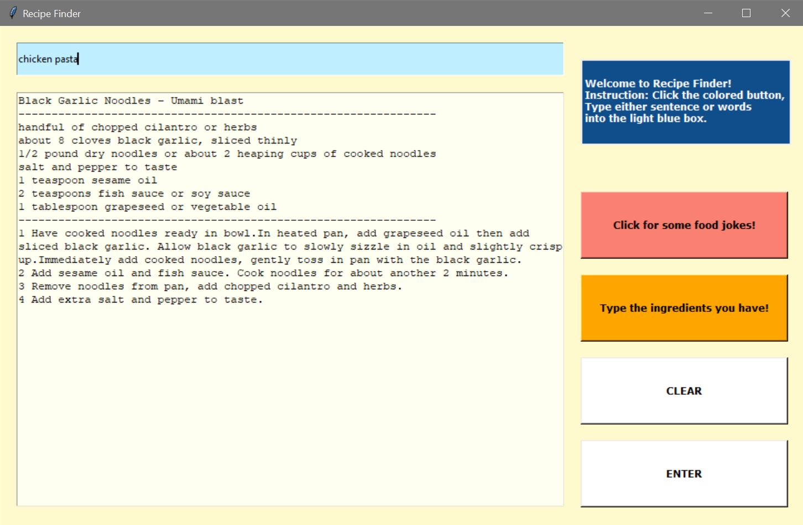

  
  <h1 align="center">Recipe Finder</h1>
  

    Not sure what to cook for dinner?! Use a recipe finder to search any recipe. Type your ingredients, and it will bring you the delicious recipe.
  Or if you're bored, you can ask for a food joke!

<!-- ABOUT THE PROJECT -->
## About The Project

### Built With

* Python
* Python - Spoonacular

<!-- GETTING STARTED -->
## The Process and What I have learned

### The Process

 I always thought about having an application where you can just type whatever you have in the refrigerator, and the application shows you what you can cook. So I created the recipe finder. I first started with a simple interface using Tkinter and used Spoonacular API to get recipes. 

### Lesson Learned

The challenging part was to parse the JSON file. Because one dish could contain many items, I had to parse it multiple times to get what I wanted. When I printed the recipe out on PyCharm to test, it just prints out as one long line, so I had to break it off every time I printed. I always thought JSON was easy to read, but I learned when there are lots of items and sub-items, it was not so easy to understand at once. But once I understood the structure, it became much easier to read and find the data I wanted.
  

